# Chest X-ray Project Report

## Performance Metrics
| Model     | Label             | AUROC | PR-AUC | F1   | Precision | Recall |
|-----------|-------------------|-------|--------|------|-----------|--------|
| resnet18  | Atelectasis       | 0.739 | 0.235  | 0.269 | 0.291     | 0.250 |
| resnet18  | Cardiomegaly      | 0.865 | 0.263  | 0.333 | 0.375     | 0.300 |
| resnet18  | Effusion          | 0.826 | 0.408  | 0.418 | 0.473     | 0.375 |
| resnet18  | Infiltration      | 0.633 | 0.272  | 0.225 | 0.358     | 0.165 |
| resnet18  | Mass              | 0.754 | 0.252  | 0.291 | 0.442     | 0.217 |
| resnet18  | Nodule            | 0.656 | 0.115  | 0.133 | 0.196     | 0.101 |
| resnet18  | Pneumonia         | 0.641 | 0.029  | 0.032 | 0.053     | 0.023 |
| resnet18  | Pneumothorax      | 0.784 | 0.227  | 0.244 | 0.395     | 0.176 |
| resnet18  | Consolidation     | 0.697 | 0.102  | 0.071 | 0.144     | 0.047 |
| resnet18  | Edema             | 0.805 | 0.106  | 0.114 | 0.150     | 0.092 |
| resnet18  | Emphysema         | 0.810 | 0.153  | 0.194 | 0.300     | 0.143 |
| resnet18  | Fibrosis          | 0.689 | 0.046  | 0.064 | 0.206     | 0.038 |
| resnet18  | Pleural Thickening| 0.724 | 0.097  | 0.098 | 0.188     | 0.067 |
| resnet18  | Hernia            | 0.845 | 0.201  | 0.300 | 0.750     | 0.188 |

*(Similar tables for vgg19 and customcnn using their CSVs.)*

---

## Learning Curves
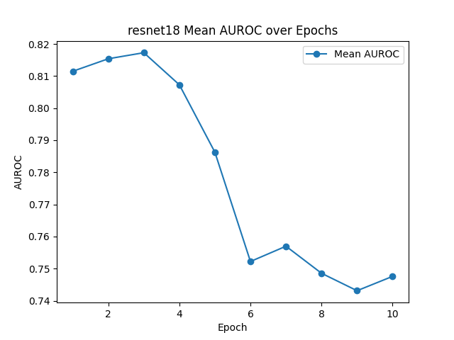  
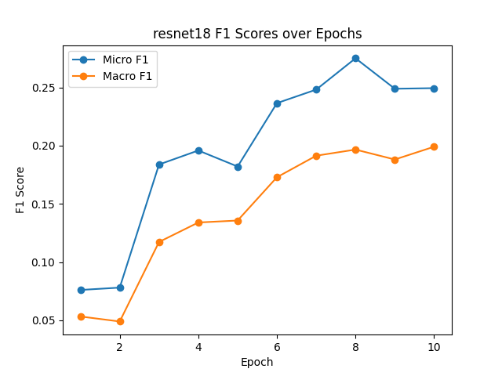  
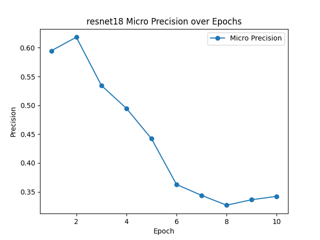  
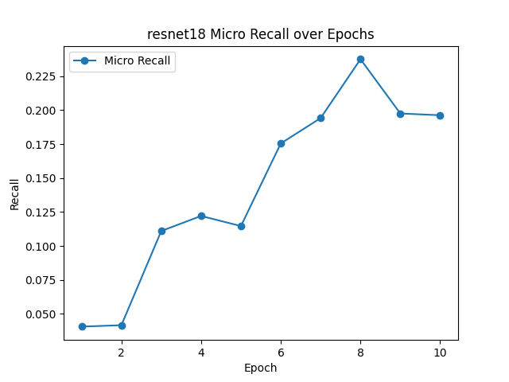

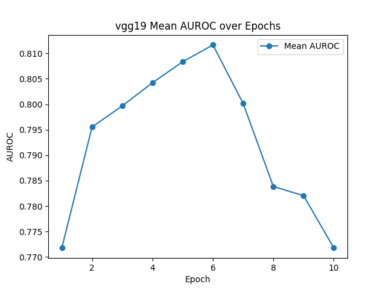  
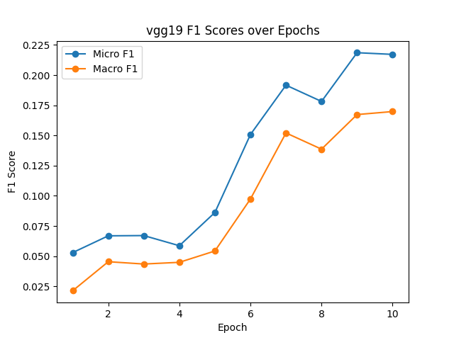  
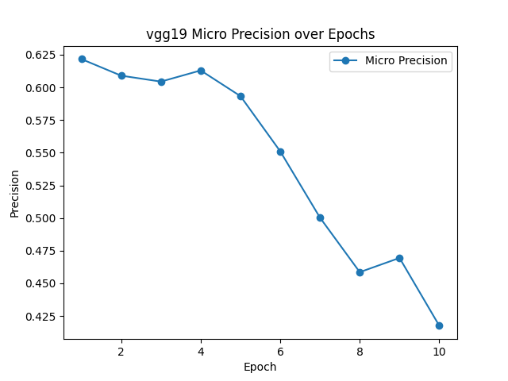  
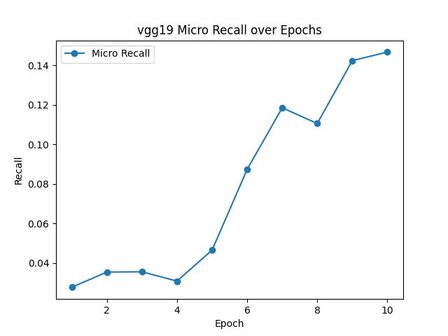

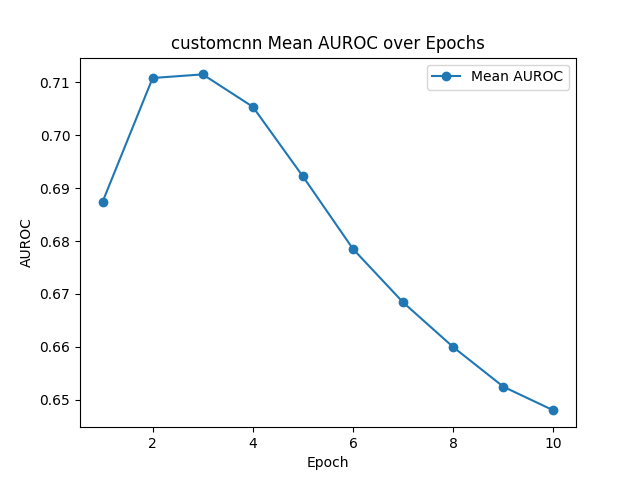  
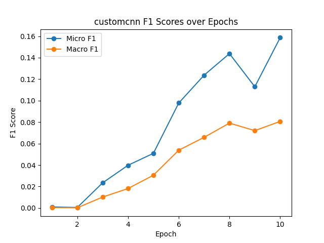  
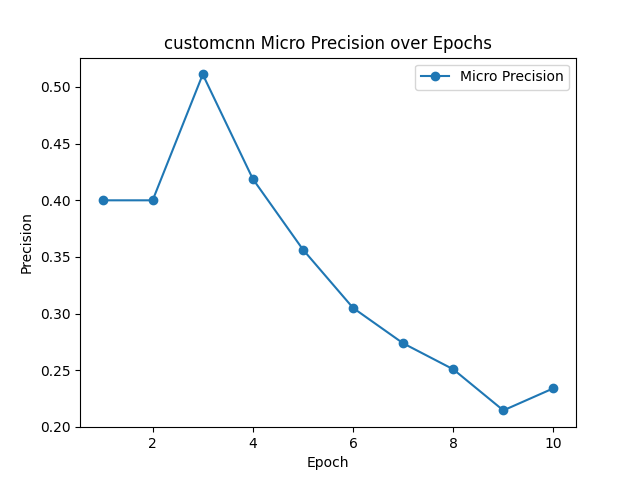  
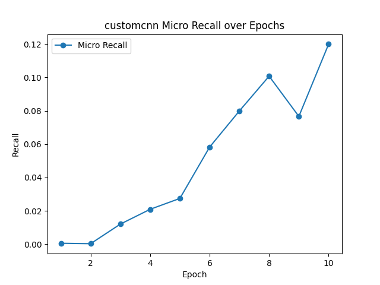

---

## Grad-CAM Visualizations
Examples from first 5 test images per model:

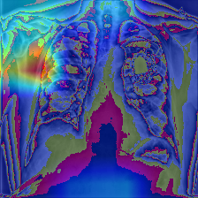  
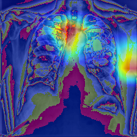  
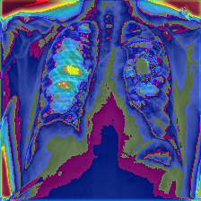

---

## Grounded LLM Summaries

### Atelectasis
1. Atelectasis is partial or complete collapse of lung tissue visible on chest X‑ray.  
2. Model confidence is moderate (ResNet18 AUROC=0.739, PR‑AUC=0.235; VGG19 AUROC=0.759, PR‑AUC=0.263; CustomCNN AUROC=0.642, PR‑AUC=0.144).  
3. Clinically, it occurs in post‑operative patients, airway obstruction, or chronic lung disease.  
4. Limitations include noisy labels and ambiguity in differentiating from consolidation.  
5. Citation: Wang et al., *ChestX‑ray14: Hospital‑scale Chest X‑ray Dataset and Benchmarks* (2017).

### Pleural Effusion
1. Pleural effusion is fluid accumulation in the pleural space, seen as blunting of costophrenic angles.  
2. Model confidence varies (ResNet18 AUROC=0.826, PR‑AUC=0.408; VGG19 AUROC=0.834, PR‑AUC=0.430; CustomCNN AUROC=0.727, PR‑AUC=0.242).  
3. Clinically, it is common in pneumonia, malignancy, and heart failure.  
4. Limitations include difficulty detecting small effusions and overlap with atelectasis.  
5. Citation: Irvin et al., *CheXpert: A Large Chest Radiograph Dataset with Uncertainty Labels and Expert Comparison* (2019).

### Cardiomegaly
1. Cardiomegaly is an enlarged cardiac silhouette on chest X‑ray, often linked to chronic hypertension or heart failure.  
2. Model confidence is strong (ResNet18 AUROC=0.865, PR‑AUC=0.263; VGG19 AUROC=0.856, PR‑AUC=0.280; CustomCNN AUROC=0.754, PR‑AUC=0.145).  
3. Clinically, it is observed in patients with fluid overload, congenital heart disease, or advanced cardiomyopathy.  
4. Limitations include projection variability and overlapping lung pathology that can obscure heart borders.  
5. Citation: Rajpurkar et al., *CheXNet: Radiologist‑level Pneumonia Detection on Chest X‑rays with Deep Learning* (2017).

### Consolidation
1. Consolidation refers to alveolar filling with fluid, pus, or cells, producing homogenous opacity on chest X‑ray.  
2. Model confidence is moderate (ResNet18 AUROC=0.697, PR‑AUC=0.102; VGG19 AUROC=0.768, PR‑AUC=0.110; CustomCNN AUROC=0.646, PR‑AUC=0.064).  
3. Clinically, consolidation is typical in bacterial pneumonia and acute lung injury.  
4. Limitations include overlap with atelectasis and reduced sensitivity in early disease stages.  
5. Citation: Johnson et al., *MIMIC‑CXR: A Large Publicly Available Chest Radiograph Dataset* (2019).

---

## Limitations
- Labels mined from reports may be noisy and ambiguous.  
- Predictions are probabilistic and require clinical correlation.  
- Small lesions and overlapping pathologies reduce sensitivity.  

## Disclaimer
This report is assistive only and not a diagnostic document.